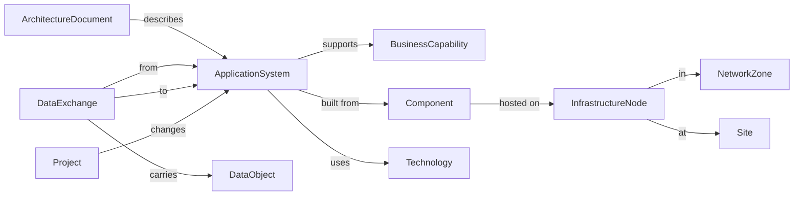

# Graph-RAG enterprise architecture agent

[](https://github.com/acceliance)
[](LICENSE)
[](https://github.com/acceliance/Graph-Rag-Enterprise-Archicturecture/commits/main)
[](https://hub.docker.com/u/acceliance)
[](https://neo4j.com/)
[](https://qdrant.tech/)
[](https://www.modelio.org/)

Ask questions about an IT department's architecture documents and get answers from a **typed knowledge graph**. The PDFs (enterprise architecture blueprints, technical architecture documents, system design documents, interface control documents, IT master plans) are read by [Acceliance Graph-RAG](https://github.com/acceliance/Graph-Rag-Deploy), which extracts the systems, the exchanges between them, the infrastructure they run on and the business capabilities they support into **Neo4j**, keeps the evidence (chunks and pages) in **Qdrant**, and answers through a web agent, a REST API and an **MCP** endpoint for external AI hosts.

This repository holds everything to run that agent for enterprise architecture: the data model, the Modelio project that governs it, sample documents, and the Docker deployment kit.

## What you can ask

- Which systems exchange data with the Medicaid claims system, and over which protocol?
- Which components of a system run on Oracle, and on which infrastructure?
- Which servers, network zones and sites host a system?
- Which business capabilities does an application support, and in which business area?
- Which systems are legacy or planned for replacement, and by which project?
- Which documents describe the same system, and how did it change between editions?

## What is in this repository

| Folder | Content |
|---|---|
| [`model/`](model/README.md) | The enterprise architecture data model, [`enterprise-architecture-model.json`](model/enterprise-architecture-model.json): 19 classes, 15 enumerations, 46 relations in six domains (business, application, integration, infrastructure, technology, governance), plus the **Modelio project** that governs it |
| [`samples/`](samples/README.md) | 15 public PDFs that describe real IT landscapes, with their sources and rights: application, infrastructure and business architecture, system design, interface control documents, in English and French |
| [`docker-compose.yaml`](docker-compose.yaml), [`.env.example`](.env.example), [`scripts/`](scripts/) | The deployment kit: four services (web, API, Neo4j, Qdrant) pulled as images, start and backup scripts |
| [`reverse-proxy/`](reverse-proxy/) | nginx and Apache examples for putting HTTPS in front |
| [`schemas/`](schemas/README.md) | JSON Schemas for the model, the ingestion ledger and the prompt files |
| [`modelio/`](modelio/) | The GraphRag module for Modelio (`GraphRag_5.4.01.jmdac`) that declares the Graph-RAG stereotypes |
| [`DEPLOY.md`](DEPLOY.md) | The full deployment guide: sizing, HTTPS, AI provider settings, backup, upgrade, troubleshooting |

## Quick start

You need Docker Desktop (Windows, macOS) or Docker Engine 24+ with Compose v2, and an AI provider key for the chat, extraction and embedding roles (entered in the application, never in a file).

```powershell
.\scripts\up.ps1        # Windows
```

```bash
scripts/up.sh           # Linux, macOS
```

The script creates `.env` with generated secrets, pulls the images, starts the stack and prints the URL, `http://localhost:8080` by default. Then:

1. Create the administrator account on the first visit.
2. Enter your AI provider settings under **Admin ▸ AI settings**.
3. On the **Model** screen, upload [`model/enterprise-architecture-model.json`](model/enterprise-architecture-model.json), then *Validate* and *Initialise*.
4. Upload the PDFs from [`samples/`](samples/README.md) (or your own) and ask questions.

For a pilot over plain HTTP set `AUTH_COOKIE_SECURE=false` in `.env`; production needs HTTPS through a reverse proxy. See [`DEPLOY.md`](DEPLOY.md).

## The model

Every extracted fact fits one of nineteen classes. Three anchor the relevance gate: `ArchitectureDocument` (each PDF is one), `ApplicationSystem` and `DataExchange`.



The complete class diagram, the design decisions and the extraction rules are in [`model/README.md`](model/README.md). The model is designed in **Modelio**, and the Modelio project is the reference: change the model there, export it, validate it, then upload it. The process is described in the *Modelio project* section of that file.

## Sample documents

[`samples/`](samples/README.md) holds 15 public documents, chosen because they describe an actual landscape (named systems, interfaces, infrastructure, business processes) and not how to practise enterprise architecture. They range from a system design document of 100 pages to a one-page technology catalogue, and from US government systems to a French hospital IT master plan.

The publishers keep the rights to these documents. Check [the rights notes](samples/README.md#rights-and-usage) before publishing this repository, and see the *Modelio* notes in the model README about the size of the Modelio project.

## Licence

The files of this repository (Compose file, scripts, schemas, model, documentation) are under the [Apache License 2.0](LICENSE). The product images are free of use under their own licence, described in [`LICENSE-IMAGES.md`](LICENSE-IMAGES.md). The sample PDFs are **not** covered by this licence: see [`samples/README.md`](samples/README.md#rights-and-usage).
