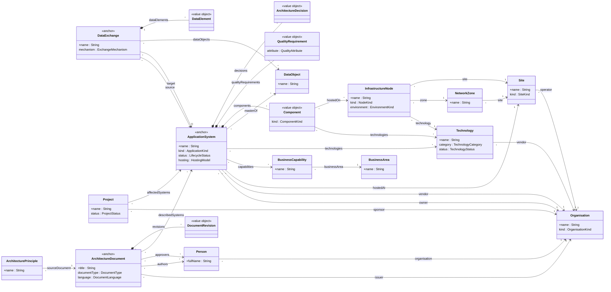

# Enterprise architecture Graph-RAG model

[`enterprise-architecture-model.json`](enterprise-architecture-model.json) is the stereotyped model (`schema_uml_model.json` format) for extracting an enterprise architecture knowledge graph from the documents in [`../samples/`](../samples/README.md). It was written by following the rules of [`Graph-Rag-Deploy/samples/prompts/generate-graphrag-model.md`](../../Graph-Rag-Deploy/samples/prompts/generate-graphrag-model.md) and extrapolated from what the sample documents (17 at the time of writing; 15 after the samples were re-checked for landscape content) actually print. The model is governed in Modelio: see [Modelio project](#modelio-project-governing-the-model).

## Domain block used (section 8 of the prompt)

| Item | Value |
|---|---|
| Documents | EA blueprints and plans, technical architecture documents (DAT), system design documents (SDD), software architecture documents (SAD), interface control documents (ICD) and interface specifications, IT master plans (SDSI), MITA self-assessments, IT audits, technology standards catalogs. English and French. Issued by government agencies, IT departments, hospitals, vendors. |
| Entities to question | Application systems and their components, the data exchanges between systems, the technologies and infrastructure they run on, the business capabilities they support, the organisations and people involved, the projects that change the landscape, the documents themselves and the principles they state. |
| Identifiers printed | System names and acronyms (STARS, MMIS, R-ICMS), process codes (EE01, CM07), document titles, versions and references (MMA.DDX.1502.04.5.1211, W103), component codes (SA-BS, MAP-UI), file and interface names, product names with versions, hostnames and role names, site names, person names in control tables. |
| Fixed lists | Organisation kind, technology category and status, site kind, node kind, environment, quality attribute, component kind, application kind, lifecycle status, hosting model, exchange mechanism, project status, document type, language. |
| Long texts to search | System purpose, component responsibility, capability description and gap analysis, requirement statements, decision rationale, exchange description, project objective, document purpose, principle statement. |
| Expected questions | Which systems exchange data with MMIS, and how? Which components of GovInfo run on Oracle? What infrastructure hosts Vitam and in which zones? Which capabilities does STARS support? Which systems are legacy or planned for replacement, by which project? Who approved the R-ICMS design document? Which documents describe the same system across versions? Which technologies are standard in Roseville? |

## Model overview

| Class | Domain | Kind | Identity | Match | Anchor | Group |
|---|---|---|---|---|---|---|
| Organisation | Governance | entity | name | fuzzy | | governance |
| Person | Governance | entity | fullName | fuzzy (0.94 / 0.80) | | governance |
| BusinessArea | Business | entity | name | fuzzy | | business |
| BusinessCapability | Business | entity | name | fuzzy | | business |
| Technology | Technology | entity | name | fuzzy (0.90 / 0.75) | | infrastructure |
| Site | Infrastructure | entity | name | fuzzy | | infrastructure |
| NetworkZone | Infrastructure | entity | name | exact | | infrastructure |
| InfrastructureNode | Infrastructure | entity | name | exact | | infrastructure |
| DataObject | Application | entity | name | fuzzy | | application |
| QualityRequirement | Application | value object of ApplicationSystem | | | | application |
| ArchitectureDecision | Application | value object of ApplicationSystem | | | | application |
| Component | Application | value object of ApplicationSystem | | | | application |
| ApplicationSystem | Application | entity | name | fuzzy | **true** | application |
| DataElement | Integration | value object of DataExchange | | | | integration |
| DataExchange | Integration | entity | name | exact | **true** | integration |
| Project | Governance | entity | name | fuzzy | | governance |
| DocumentRevision | Governance | value object of ArchitectureDocument | | | | governance |
| ArchitectureDocument | Governance | entity | title | exact | **true** | governance |
| ArchitecturePrinciple | Governance | entity | name | exact | | governance |

19 classes, 15 enumerations, 73 attributes, 46 relations, 5 extraction groups (one LLM call each: governance, business, infrastructure, application, integration).

### Main relations

Class-to-class relations only, generated from the model file. Each class shows its identity attribute (`+`) and its relations to enumerations (the fixed lists, see the JSON); a filled diamond marks ownership (`OneToMany`: the owner holds the list and the owned class is a value object with no identity key of its own); arrows are `ManyToOne` or `ManyToMany` references. `<<anchor>>` classes are the relevance anchors.



## Design decisions

- **Three anchors.** `ArchitectureDocument` (every PDF is one), `ApplicationSystem` (the subject of SDDs, SADs and DATs) and `DataExchange` (the subject of ICDs). Finding any of them proves a document belongs to the domain.
- **Components are value objects, not entities.** Names like "Admin" or "Data Store" recur across unrelated systems, so a global identity key would merge them wrongly. Each system owns its components through `components` (OneToMany). The price is that the two GovInfo editions (samples 05 and 06) each produce their own component set.
- **One document, many revisions.** `ArchitectureDocument` is identified by its title without the version, so successive editions merge into one entity whose `revisions` hold the version history. `version` and `publicationDate` on the entity describe the edition that was read.
- **Acronyms are attributes, not identity.** Documents switch between "State Titling and Registration System" and "STARS". The identity is the full name with fuzzy matching; the hint tells the extractor to use the acronym as the name only when nothing else is printed.
- **Products versus organisations.** `Technology` holds products, protocols and standards; vendors are `Organisation` entities linked through `vendor`, so "Microsoft" is one node whatever product is mentioned.
- **Field-level layouts are kept.** ICDs and interface specifications are mostly record-layout tables, which is what makes them useful for questions about what an exchange carries. `DataElement` rows belong to their `DataExchange`.
- **No self-references.** Hierarchies (parent organisation, parent capability, sub-component) are flattened: `BusinessArea` groups capabilities, and a component's parent goes in its `layer` attribute. This keeps every class ordered after the classes it references, as the prompt requires.
- **Groups.** Technology is extracted with the infrastructure group because standards catalogs and DATs print products and nodes together; DataObject goes with the application group because data models sit in SDDs.

## Modelio project: governing the model

The model is governed in [Modelio](https://www.modelio.org/) 5.4, in the project [`modelio_uml_project/Enterprise Architecture Model/`](modelio_uml_project/). The Modelio project is the **reference**; `enterprise-architecture-model.json` is the file exported from it and uploaded to Graph-RAG. Change the model in Modelio, never in the JSON, so the two cannot drift apart. The workflow is described in [`../DEPLOY.md`](../DEPLOY.md#3a-designing-the-model-in-modelio).

### What the project contains

| Modelio element | Content | Matches the JSON |
|---|---|---|
| Package tree `com.yourcompany.enterprisearchi` | Root of the exported model. It holds one package per domain: `Application`, `Business`, `Governance`, `Infrastructure`, `Integration`, `Technology` | the `domain` of each class and enumeration |
| 19 classes | Every class of the model, in the package of its domain, with its 73 attributes (types and descriptions as notes) | `classes[]` |
| 15 enumerations | With their literals (115 values in total) | `enumerations[]` |
| 46 associations | Directed, with role names and cardinalities | `relations[]` |
| Stereotypes `GraphRagEntity` (19 classes), `GraphRagIdentity` (14 attributes), `GraphRagEmbed` (11 attributes) | With their tagged values (match, thresholds, anchor, extraction hints, group, normalise) | `stereotypeInstances` |
| Class diagram `Enterprise Architecture` | An empty diagram in the `Diagrams` package, ready for a picture of the model. The diagram in the section above is generated from the JSON instead | not exported |

The names and counts were checked against the JSON on 2026-09-30 and agree exactly: 19 classes, 73 attributes, 15 enumerations, 46 associations, 9 fuzzy classes and 3 anchors.

### Modules the project uses

Modelio modules are deployed per project. The project uses six (declared in `project.conf`); only the first two matter for this model.

| Module | Version | Role |
|---|---|---|
| **GraphRag** | 5.4.01 | Declares the three Graph-RAG stereotypes and their tagged values. Comes from [`../modelio/GraphRag_5.4.01.jmdac`](../modelio/GraphRag_5.4.01.jmdac). |
| **ModelioUtils** | 5.4.01 | **Export Model** and **Import Model**: turns the UML model, stereotypes included, into `schema_uml_model.json` and back. Its parameter *Enable Model Export* must be `true`. |
| CartographyManager | 5.4.01 | Cartography and dictionary features of the same tool set. It marks the export root with its stereotype `CartographyManagerRootOfTheModel`. |
| ExcelUtils | 5.4.01 | Excel import and export helpers. |
| DiagramColorizer | 5.4.01 | Colours diagrams and exports them to PNG or draw.io. |
| ModelerModule | 9.4.00 | Modelio's own standard modeller module. |

### Change process

1. Open the project in Modelio 5.4. The modules above must be deployed (Modules view); the GraphRag module must be active, since the import checks every stereotype property against it.
2. Make the change in Modelio: a class, attribute, association, enumeration literal, or a tagged value (for example the extraction hints of a class).
3. Right-click the export root package ▸ **Export Model** (ModelioUtils) and write the file over `enterprise-architecture-model.json`.
4. Check it: the schema layer with `check-jsonschema` (see [Validation](#validation)), then the *Model* screen or `POST /model/validate`, which apply the product's rules.
5. Update this README if the change alters the counts, the diagram or a design decision. The relations diagram above is generated from the JSON; regenerate it when relations change.
6. Upload the file on the *Model* screen: *Initialise* for a first load, *Upgrade* for a new version of a model already in use.
7. Commit the JSON and the Modelio project together, in one commit.

To bring a JSON file into Modelio instead (for example a fix made by an assistant that followed the [prompt](../../Graph-Rag-Deploy/samples/prompts/generate-graphrag-model.md)), use **Import Model** on the export root package, then review the diff before exporting again.

### Rules

- **One reference.** Edit the Modelio project, then export. Never edit the JSON by hand, and never edit the files under `data/fragments/`: Modelio marks them `GENERATED FILE, PLEASE DO NOT EDIT`.
- **Stereotypes only.** Graph-RAG settings live in the model as GraphRag stereotypes. Relevance-gate thresholds are not part of the model and belong to the model version (`PUT /model/gate`).
- **Naming rules apply in Modelio too**: PascalCase for classes and enumerations, camelCase for attributes and relations, SCREAMING_SNAKE_CASE for literals. A fixed list of values is an enumeration reached through a `OneToOne` association, never an attribute typed with the enumeration.
- **Domains are packages.** A class belongs to the domain of its package. Moving a class to another package changes its `domain` in the export.
- **Every change is exported and validated** before it reaches Graph-RAG, and a model already in use is changed through *Upgrade*, not by replacing it.

### Practical notes

- **Module paths are absolute.** `project.conf` points at the module archives on the author's machine (under `C:\Users\joset\`), so on another machine Modelio asks for the modules again. The archives are also stored in the project itself, under `data/backups/modules/`, so they can be redeployed from there.
- **Repository weight.** The project is about 114 MB, almost all of it the module archives in `data/backups/modules/` (CartographyManager 37 MB, DiagramColorizer 46 MB, ExcelUtils 17 MB, ModelioUtils 15 MB). The model itself is 5.5 MB (`data/fragments/`). If the repository size becomes a problem, keep the archives out of git and reinstall the modules from their sources.
- **Windows paths.** Some files in the project have paths over 260 characters. Git on Windows needs `git config core.longpaths true` (already set in this clone).
- **Line endings.** Git may warn that LF will be replaced by CRLF in the project files; this is harmless. `.gitattributes` keeps the JSON, Markdown and scripts on LF.

## Validation

The model passes the schema and the product's checks (`validate_model` and the stereotype split from `graphrag-api/graphrag/model/`) with no errors or warnings, and the prompt's self-check list (ordering, value-object ownership, fuzzy and anchor rules, name patterns).

To re-check the schema layer:

```bash
check-jsonschema --schemafile ../../Graph-Rag-Deploy/schemas/schema_uml_model.json enterprise-architecture-model.json
```

Then upload it on the *Model* screen or send it to `POST /model/validate`.

## Next steps

- Load the model in Graph-RAG and ingest `../samples/` to see which hints need tuning; the field-level `DataElement` extraction on the 174-page Minnesota specification (sample 19) is the most expensive part and can be dropped from the model if it is not worth it.
- Relevance-gate thresholds are not in the model; set them per model version through `PUT /model/gate`.
